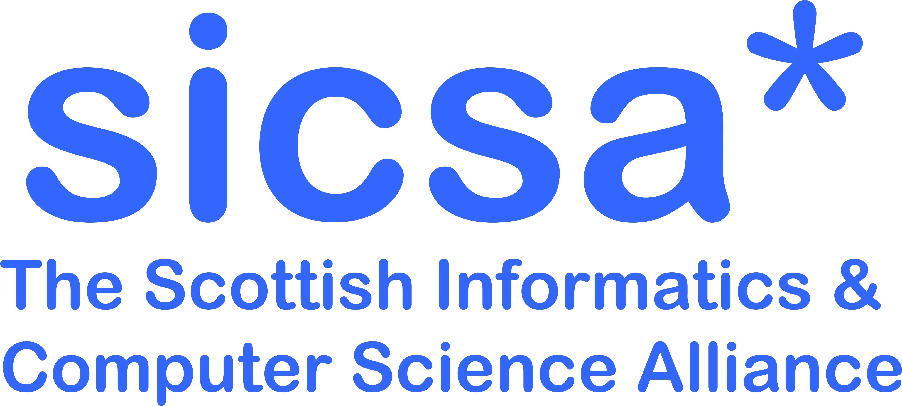

---

title: "SPLS, 22 November 2023, University of Strathclyde"
custom_css: custom
---

# Scottish Programming Languages Seminar

## Wednesday, 22nd November 2023

The [Scottish Programming Languages Seminar (SPLS)](https://scottish-pl-institute.github.io/spls) Series is an informal meeting of the [Scottish Programming Languages Institute (SPLI)](https://scottish-pl-institute.github.io/) Community for discussing anything related to programming languages.

This edition of SPLS will be hybrid and is organised by the [MSP Group](https://msp.cis.strath.ac.uk) of the Department of Computer & Information Sciences at [University of Strathclyde](https://www.strath.ac.uk).

We will be physically located in the **McCance Building, room MC301** at the University of Strathclyde.
Accessibility information is [available here](https://www.accessable.co.uk/university-of-strathclyde-glasgow/).

For online participants we will stream the talks using [YouTube](https://www.youtube.com/@scottishprogramminglanguag8396).

We kindly acknowledge the continuing sponsorship of the [Scottish Informatics and Computer Science Alliance (SICSA)](https://sicsa.ac.uk).

      
      &nbsp;&nbsp;
            &nbsp;&nbsp;
                  &nbsp;&nbsp;
                        &nbsp;&nbsp;
        
    

## Registration

+ If you plan to attend in person register by the **8th November 2023** using [this form](https://forms.office.com/e/qwExcRjAtg).
+ If you wish to give a talk then please indicate it in the above form. If your title or abstract is yet to be determined, they can be sent by the **15th November 2023** per email to one of the organizers.
+ If you want to attend the morning PhD event, please also fill in your name by the **8th November 2023** [here](https://forms.office.com/e/jP6C5NP5tM).
+ Registration is required for catering.

### COVID Information

+ There are no COVID restrictions on attendance, however, we welcome mask wearing in packed indoor areas as well as testing on the morning prior to attending.

## Programme

#### 10:00 - 12:00 PhD EVENT

<table>
      <tr>
      <td class="phdevent">
        In-person event for PhD students.
          <ul>
            <li>10:00 - 10:30 &nbsp;&nbsp; Coffee and welcome </li>
            <li>10:30 - 11:30 &nbsp;&nbsp; University and SPLI presentation </li>
            <li>11:30 - 12:00 &nbsp;&nbsp; Live Q&A </li>
          </ul>
        </td>
      </tr>
</table>

#### 12:00 - 13:00  LUNCH

#### 13:00 - 14:00  SESSION 1: TBD

#### 14:00 - 14:30  COFFEE

#### 14:30 - 15:30  SESSION 2: TBD

#### 15:30 - 16:00  COFFEE

#### 16:00 - 17:00  SESSION 3: TBD

#### 17:00 - late   DINNER/PUB

## Travel

The University of Strathclyde is located a short (five minutes) walk from Glasgow Queen Street, heading east from the City Centre. Glasgow Central Station is 15 minutes away.
The University provides [travel information](https://www.strath.ac.uk/maps/) including maps and directions.

The McCance Building on the map ([larger version](https://www.openstreetmap.org/?mlat=55.86127&mlon=-4.24475#map=17/55.86127/-4.24475)):

      <iframe width="800" height="400" src="https://www.openstreetmap.org/export/embed.html?bbox=-4.248393774032594%2C55.85975505996792%2C-4.241098165512086%2C55.862789647739675&amp;layer=mapnik&amp;marker=55.86127145065651%2C-4.244746050000003" style="border: 1px solid black">
      </iframe>

## Organising Committee

Should you have comments or queries about the event please contact one of the organisers:

+ **Principal**: Riu Rodríguez Sakamoto \<riu.rodriguez-sakamoto AT strath DOT ac DOT uk\>, Dilsat Yuksel \<dilsat.yuksel AT strath DOT ac DOT uk\>
+ **Junior**: Jan de Muijnck-Hughes, Fredrik Nordvall Forsberg
