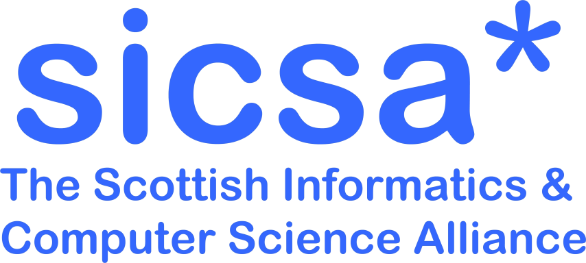

---

title: "SPLS, 1 July 2024, University of Edinburgh"
custom_css: custom
---

# Scottish Programming Languages Seminar

## Monday, 1st July 2024

The [Scottish Programming Languages Seminar (SPLS)](https://spli.scot/spls) Series is an informal meeting of the [Scottish Programming Languages Institute (SPLI)](https://spli.scot/) Community for discussing anything related to programming languages.

This edition of SPLS will be hybrid and is organised by the the [School of Informatics](https://informatics.ed.ac.uk/) at [University of Edinburgh](https://www.ed.ac.uk).

We will be physically located in **40 George Square, room LG.09** at the University of Edinburgh.
Accessibility information is [available here](https://www.accessable.co.uk/the-university-of-edinburgh/central-area/access-guides/40-george-square-lower-ground-teaching-hub).

For online participants, we will send a Zoom link via the SPLS mailing list and on the SPLS Zulip closer to the date.

We kindly acknowledge the continuing sponsorship of the [Scottish Informatics and Computer Science Alliance (SICSA)](https://sicsa.ac.uk).

      
      &nbsp;&nbsp;
            &nbsp;&nbsp;
                  &nbsp;&nbsp;
                        &nbsp;&nbsp;
        
    

#### Invited Speaker

We are happy to announce that **[José Pedro Magalhães](http://dreixel.net/)**, a Managing Director at Standard Chartered Bank, will be giving the keynote.

<!-- Lazy, using the abstract button -->

<button onclick="showAbstract('JoseBio')">Show biography</button>

<button onclick="hideAbstract('JoseBio')">Hide biography</button>

José Pedro Magalhães is a Managing Director leading a team of ~45 quantitative developers at Standard Chartered Bank. He is also one of the founders of Chordify.
Before joining Standard Chartered, he was a postdoctoral research assistant in the Programming Languages group at the Department of Computer Science of the University of Oxford, working on the Unifying Theories of Generic Programming project.
Previously he was a PhD student at the Department of Information and Computing Sciences of Utrecht University in the Netherlands. His PhD topic was Real-Life Datatype Generic Programming, supervised by Johan Jeuring, Andres Löh, and Doaitse Swierstra. Before that he graduated from Minho University in Computer Science and Systems Engineering (Licenciatura em Engenharia de Sistemas e Informática).
He has also been a Summer Student at CERN, an intern at Philips Research, and a research intern at Microsoft Research Cambridge.

## Registration

+ ~~If you plan to attend in person register by the **19th June 2024** using [this form](https://forms.office.com/e/0zUMNaUxVj).~~
+ If you wish to give a talk then please indicate it in the above form. If your title or abstract is yet to be determined, they can be sent by the **24th June 2024** per email to one of the organizers.
+ Registration is required for catering.

## Programme

Please find the tentative schedule below:

#### 11:30&mdash;12:30 &nbsp;&nbsp; Session 1: Keynote
<table>
  <tr>
    <td class="author">
    José Pedro Magalhães (Standard Chartered Bank)
    </td>
    <td class="title">
      
      Functional Programming in Financial Markets
      
      

        <button onclick="showAbstract('Jose')">Abstract</button>
      

      

        <button onclick="hideAbstract('Jose')">Hide Abstract</button>
        

        In this talk we showcase the application of functional programming in a very large industrial setting. At Standard Chartered Bank, Haskell forms the core of a software library supporting the entire Financial Markets (FM), a business line with 5 billion USD operating income in 2023. Typed functional programming is used across the entire tech stack, including foundational APIs and CLIs for deal valuation and risk analysis, server-side components for long-running batches or sub-second RESTful services, and end-user GUIs. Thousands of users interact with software built using functional programming, and over one hundred write their own functional code.
          
        We present the history of how functional programming established itself in FM, including the rationale for having our own compiler and dialect of Haskell. We then focus on how we leverage it to orchestrate type-driven large-scale pricing workflows. The same API can be used to price one trade locally, or millions of trades across thousands of nodes in the cloud. We build upon decades of research and experience in the functional programming community, relying on concepts such as monads, lenses, datatype generics, and closure serialisation.
        

      

    </td>
  </tr>
</table>

#### 12:30&mdash;13:30 &nbsp;&nbsp; Lunch (with coffee)
#### 13:30&mdash;14:30 &nbsp;&nbsp; Session 2: Talks
<table>
  <tr>
    <td class="author">
    Danielle Marshall (Glasgow and Kent)
    </td>
    <td class="title">
      
      Linearity, Uniqueness, Ownership: An Entente Cordiale
      
      

        <button onclick="showAbstract('Danielle')">Abstract</button>
      

      

        <button onclick="hideAbstract('Danielle')">Hide Abstract</button>
        

        Substructural type systems, which restrict the use of weakening and contraction rules from intuitionistic logic, are growing in popularity because they allow for a resourceful interpretation of data which can be used to rule out software bugs. Substructurality is finally taking hold in practical programming: Haskell now has linear types based on Girard's linear logic but integrated via graded function arrows, Clean has uniqueness types ensuring that values have at most a single reference, and Rust has an intricate ownership system guaranteeing memory safety. But despite this broad range of resourceful type systems, there has been comparatively little work on understanding their relative strengths and weaknesses. We demonstrate how linear types and uniqueness types can be used within a single system in the setting of the Granule language to offer both restrictions on local program behaviour and guarantees about global memory usage. We then extend this framework further, by showing that just like graded type systems as in Granule or Idris build upon linearity, Rust's ownership model builds upon uniqueness. We develop an extended type system incorporating ownership and borrowing based on ideas from both fractional permissions and graded types, and implement this in Granule.
        

      

    </td>
  </tr>
  <tr>
    <td class="author">
    Bruce Collie (Runtime Verification, Inc.)
    </td>
    <td class="title">
      
      Meeting Developers Where They Are: Lessons Learned from Formal Verification in Practice
      
      

        <button onclick="showAbstract('Bruce')">Abstract</button>
      

      

        <button onclick="hideAbstract('Bruce')">Hide Abstract</button>
        

        Most (if not all) attendees of this workshop will have some idea of the benefits of applying formal verification techniques to software: we can prove to ourselves and others that our code behaves properly, rather than simply asserting this claim by testing (or worse, asserting it without substantiation). However, in our experience, the average developer "on the street" is not aware of these benefits, and even if they are, they may lack the time, opportunity or masochism required to start applying academic tools to their code in practice.
          
        This talk is a tour through some of the lessons we've learned trying to get developers on board with formal verification in practice. I'll cover the underlying PL semantics techniques we base our work on, then go through a few representative examples of how we've tried to make more accessible and applicable FV software by meeting users "where they are", all without compromising on the underlying rigour and power of the tools in question.
        

      

    </td>
  </tr>
</table>

#### 14:30&mdash;15:00 &nbsp;&nbsp; Break (with coffee)
#### 15:00&mdash;16:00 &nbsp;&nbsp; Session 3: Talks
<table>
  <tr>
    <td class="author">
    Conor McBride (Strathclyde)
    </td>
    <td class="title">
      
      Fulls Seldom Differ
      
      

        <button onclick="showAbstract('Conor')">Abstract</button>
      

      

        <button onclick="hideAbstract('Conor')">Hide Abstract</button>
        

        One use for type-level numbers is to capture patterns of scaling up, e.g. "adding a pair of 2^n bit numbers and a carry-in to get a carry-out and a 2^n bit sum". These patterns often rely on reasoning steps such as "2^n is even iff n is a successor". We reach a place where type-level arithmetic is no longer enough. It's healthy to ask how the language of type-level numeric expressions impacts on the division of algebraic labour between programmer and typechecker. I'll present the current state of my enquiries, but the key observation is that (2^) is a troublesome primitive, but its neighbour, full(n) = (2^n)-1 (i.e., the n-bit number full of 1s) is remarkably cooperative. The numbers which happen to be the difference between two fulls have some rather special properties, yielding a carefully curated constraint space with a complete unification algorithm.
        

      

    </td>
  </tr>
  <tr>
    <td class="author">
    Dylan Thinnes (Digital Asset)
    </td>
    <td class="title">
      
      Structured Error Messages and Error Postprocessing
      
      

        <button onclick="showAbstract('Dylan')">Abstract</button>
      

      

        <button onclick="hideAbstract('Dylan')">Hide Abstract</button>
        

        TBD
        

      

    </td>
  </tr>
</table>

#### 16:00&mdash;16:30 &nbsp;&nbsp; Break (*no* coffee)
#### 16:30&mdash;17:30 &nbsp;&nbsp; Session 4: Talks
<table>
  <tr>
    <td class="author">
    Robert Wright (Edinburgh)
    </td>
    <td class="title">
      
      First-class Algebraic Presentations with Elaborator Reflection
      
      

        <button onclick="showAbstract('Robert')">Abstract</button>
      

      

        <button onclick="hideAbstract('Robert')">Hide Abstract</button>
        

        We present a library for the ergonomic creation, manipulation, and use of first-order algebras. We do not rely on hard-coded syntactic support for our embedded language. Instead, we use metaprogramming to provide syntactic sugar for creating and using user-definable deeply-embedded first-order algebras.
        

      

    </td>
  </tr>
  <tr>
    <td class="author">
    Jeremy Singer (Glasgow)
    </td>
    <td class="title">
      
      Haskell in High School: Functional Programming for School Age Learners
      
      

        <button onclick="showAbstract('Jeremy')">Abstract</button>
      

      

        <button onclick="hideAbstract('Jeremy')">Hide Abstract</button>
        

        In conjunction with a colleague from Stanford University, we are deploying Haskell programming materials in Welsh high schools. The aim is to enable participants to create learning and teaching resources for algebra as part of work towards the Welsh Baccalaureate. In this short talk, I will review the Haskell materials used and consider the responses from early adopters. I will highlight challenges and opportunities related to teaching functional programming to younger learners.
        

      

    </td>
  </tr>
</table>

#### 17:30&mdash;late &nbsp;&nbsp; Pub

## Travel

The University of Edinburgh (Central Area) is located a short (fifteen minutes) walk from Edinburgh Waverley, heading south from the City Centre.
The University provides [travel information](https://www.ed.ac.uk/maps/) including maps and directions.

40 George Square on the map ([larger version](https://www.openstreetmap.org/?mlat=55.94319&mlon=-3.18647#map=19/55.94319/-3.18647)):

      <iframe width="800" height="400" src="https://www.openstreetmap.org/export/embed.html?bbox=-3.187499642372132%2C55.94266775633066%2C-3.185439705848694%2C55.94371320142805&amp;layer=mapnik&amp;marker=55.94319048240691%2C-3.1864696741104126" style="border: 1px solid black"></iframe>

## Organising Committee

Organised by Jesse Sigal, Brian Campbell, and Xueying Qin.

Should you have comments or queries about the event please contact one of the organisers by email &lt;firstname DOT lastname AT ed DOT ac DOT uk&gt; or on Zulip.

<footer>

Last updated: {{ site.time | date: '%B %d, %Y' }}

</footer>
